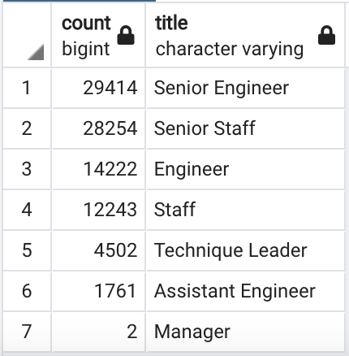
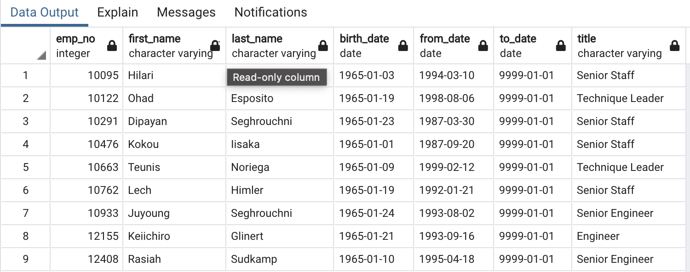

# Pewlett-Hackard-Analysis
## Overview of the Analysis
Pewlett-Hackard has fallen a bit behind in the database department, so it will be a huge achievement to get this organized for the company. Bobby has got an exciting new assignments manager has asked him to determine the number of retiring employees per title and identify employees who are eligible to participate in a mentorship program. Then, write a report that summarizes your analysis and helps prepare Bobby’s manager for the “silver tsunami” as many current employees reach retirement age.

## Analysis & Results

### Analysis

Technical analysis was carried out in two parts:
1. The Number of Retiring Employees by Title
2. The Employees Eligible for the Mentorship Program

For the First part, using the ERD created and with our knowledge of SQL queries, created a Retirement Titles table that the titles of current employees who were born between January 1, 1952 and December 31, 1955. 

Because some employees may have multiple titles in the database—for example, due to promotions— we'll need to use the DISTINCT ON statement to create a table that contains the most recent title of each employee. 

Then, use the COUNT() function to create a final table that has the number of retirement-age employees by most recent job title.

Here are the results showing the number if retirement-age employees by most recent job title

For the second part of the analysis, using the ERD created as a reference and with the knowledge of SQL queries, created a mentorship-eligibility table that holds the current employees who were born between January 1, 1965 and December 31, 1965.

Here are the results for the 

### Results

- The first part of analysis gives us a clear picture of number of retiring employees by title. This gives the PH HR department a good idea as to how many positions must be filled in each department.
- To fill 903,98 roles is a lot of work & time consuming. So, the data provided in the first part of analysis can help PH for future planning, and to start ahead of time with the recruitment process.
- The second part of analysis identified; the employees eligible to participate in the mentorship program
- The second part of analysis gives PH to plan for the mentorship program for the new generation that join PH.

## Summary

Doing this analysis for PH gives them an opportunity to have a plan for the future.

- There are 903.98 roles that need to be filled which is huge impact for PH & the HR department. The query written to get the above number is SELECT COUNT (*) FROM unique_titles;

- Form the mentorship eligibility table we can see that there 1549 employees in the department to mentor the next generation of PH employees. The query written to get the mentorship eligibility number is SELECT COUNT (*) FROM mentorship eligibility;
